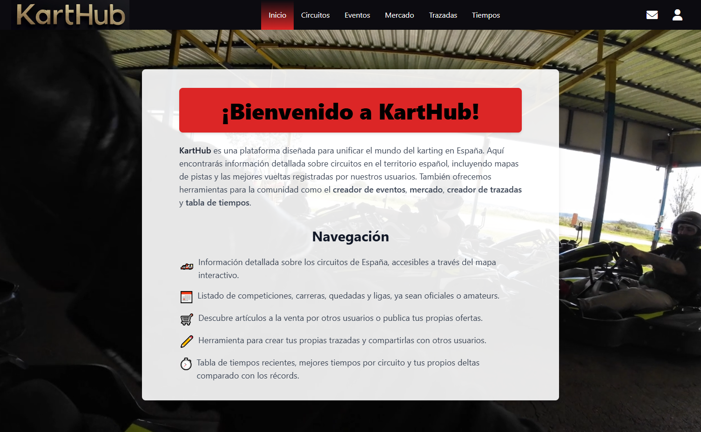

# Parte Back-End del trabajo de Fin de Bootcamp de NEOLAND

[](https://app.netlify.com/sites/karthubsite/deploys)

## Descripción

La aplicación consiste en una serie de herramientas para el mundillo del karting. Tiene información acerca de los circuitos, un creador de eventos, un mercado simple para listar objetos, un creador de trazadas para poder pintar y visualizar tus trazadas en los circuitos, una tabla de tiempos de los usuarios y sistema de perfiles y mensajería. Se accede desde el index.html y por ahora no hay un sistema de permisos. Ésta es la parte Back del proyecto.

La aplicación se encuentra aqui: [Karthub](https://karthubsite.netlify.app/)



Disponemos de::

* Index, con la landing page y el sistema de logueo y creación de perfiles.
* Apartado de circuitos, con un mapa y la info de algunos de ellos.
* Listado y creador de eventos, una parte social de la web.
* Mercado, para poner a la venta diferentes artículos.
* Trazadas, para poder pintar en los mapas tus recorridos y luego poder guardarlos, ya sea en tu perfil o en tu PC.
* Tabla de tiempos, con los últimos tiempos de los usuarios, filtros para ordenar por récord y una minitabla para ver tus vueltas comparándolas con el delta del record.

El código está desarrollado en Js nativo, con dos versiones del login una en web components nativos y la otra usando Lit.

Conocimientos del curso aplicados en este repositorio:

* Servidores node.js
  * Estático, CRUD y de api por JSON para simular una base de datos (en desuso)
  * Servidor Express.js, actualmente activo.
* Base de datos MongoDB alojada en MongoDB Atlas.
* Queries de MongoDB
* GitHub como gestión de Repositorio

La parte Back-end de este proyecto se encuentra aqui: [PFBNeoland](https://github.com/Jotanore/PFBNeoland)

## Dependencias de la aplicación

* Node
* Express
* MongoDB
* JSDoc
* Typescript
* Tailwind CSS
* ESLint
* Lint-Staged
* StyleLint
* Netlify

## Plugings de VS Code recomendados

* [commitlint](https://marketplace.visualstudio.com/items?itemName=joshbolduc.commitlint)
* [Conventional Commits](https://marketplace.visualstudio.com/items?itemName=vivaxy.vscode-conventional-commits)
* [Error Lens](https://marketplace.visualstudio.com/items?itemName=usernamehw.errorlens)
* [ESLint](https://marketplace.visualstudio.com/items?itemName=dbaeumer.vscode-eslint)
* [GitHub Pull Requests](https://marketplace.visualstudio.com/items?itemName=GitHub.vscode-pull-request-github)
* [Live Preview](https://marketplace.visualstudio.com/items?itemName=ms-vscode.live-server)
* [markdownlint](https://marketplace.visualstudio.com/items?itemName=DavidAnson.vscode-markdownlint)
* [Postman](https://marketplace.visualstudio.com/items?itemName=Postman.postman-for-vscode)
* [Stylelint](https://marketplace.visualstudio.com/items?itemName=stylelint.vscode-stylelint)

## Instalación y ejecución

```bash
npm install
```

Ejecutar en el terminal el servidor del backend.

```bash
run express-server
```

Acceso desde: [http://127.0.0.1:6431](http://localhost:6431)
La configuración de los puertos está definida en el archivo .env, no incluído en el repositorio de git.

Cada función intenta cumplir con los estándares de SOLID.

## Documentación

Para generar la documentación de la aplicación se usa [JSDoc](https://jsdoc.app) y se guarda en la carpeta ```out```.

## Modelo de Datos

Circuit = {
     _id
    name
    location
    url
    description
    bestlap
    prices
    map
}

MarketItem = {
     _id
    user_id
    article
    price
    location
    description
    img
}

EventCard = {
    _id
    title
    date
    user_id
    description
    location
    participants
    maxParticipants
    location_id
}

User = {
    _id
    username
    name
    email
    password
    surnames
    location
    bio
    img
    prefCircuit
    kart
    youtube
    instagram
    role
    token
    sentMessages
    receivedMessages
}

LapTime = {
    _id
    user_id
    username
    circuit
    circuit_id
    lapTimeDate
    kartType
    kartInfo
    lapCondition
    laptime
    timeSheet
    lapLink
}

RaceLines = {
    _id
    user_id
    circuit_id
    img
    date
}

Message = {
    _id
    sender_id
    receiver_id
    title
    message
    date
    isNew
    receiver_username
    sender_username
}

## Relacion entre componentes

Para las diversas páginas, tenemos un archivos bundle que importa los componentes utilizados en esa página.
